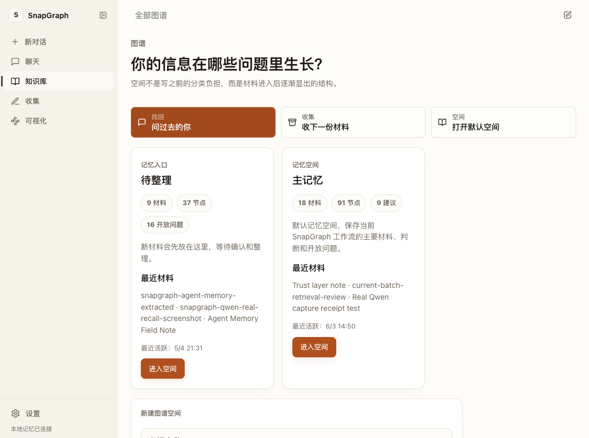
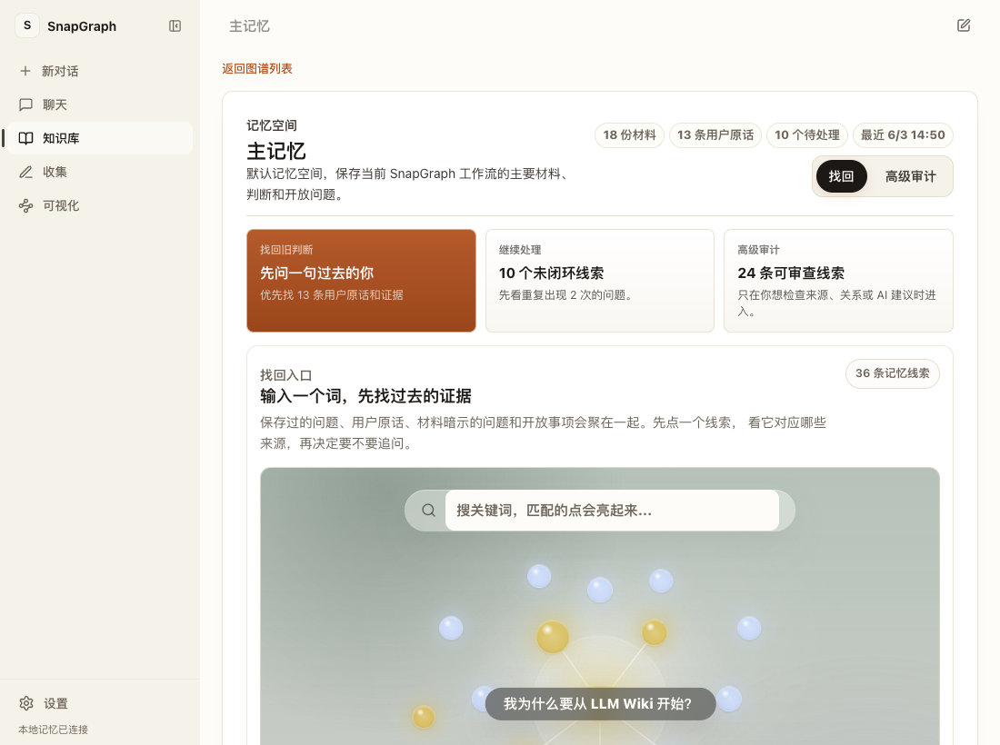
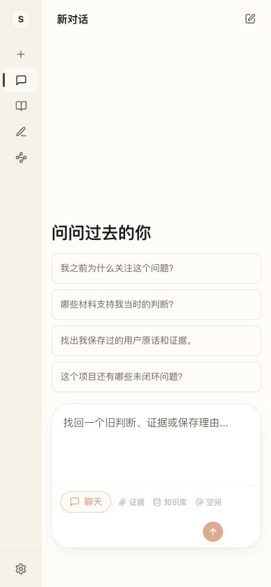
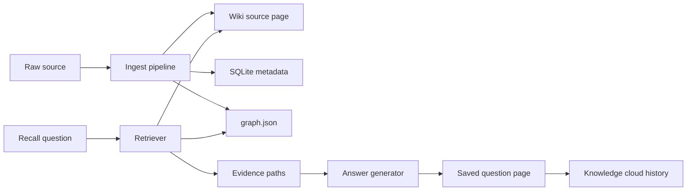

# SnapGraph

> A local cognitive memory system for preserving not just sources, but the reason they mattered.


SnapGraph is a cognitive LLM Wiki. It turns notes, links, text files, PDFs, screenshots, and saved answers into a local memory workspace with immutable sources, generated wiki pages, graph paths, and evidence-backed recall.

Most note apps remember *what* you saved. SnapGraph also preserves:

- why it mattered at the moment of capture
- which project, question, person, or open loop it relates to
- whether the reason was user-stated or AI-inferred
- which original sources support a later answer
- how an old answer can be reopened and continued

<p align="center">
  
</p>

## Product Shape

SnapGraph combines four product surfaces:

| Surface | Purpose |
| --- | --- |
| **Ask Past** | Ask fuzzy questions such as "Why did I care about this?" and recover prior context with local evidence first. |
| **Emerge** | Review open loops, AI-inferred context, and newly surfaced graph connections without losing source traceability. |
| **Collect** | Save raw material with an optional user-stated reason. Raw sources remain traceable. |
| **Shelf** | Browse graph spaces, saved questions, materials, diagnostics, and the memory constellation. |

<p align="center">
  
</p>

The current frontend is a real Vue/FastAPI app, not a throwaway mockup. It includes a paper-like SnapGraph shell, chat history in the sidebar, multi-turn recall threads, Deep Thought streaming, graph-space creation, a draggable memory cloud, source evidence lists, and mobile responsive layouts.

<p align="center">
  
</p>

## Core Features

- **Immutable source archive**: copied raw inputs, source hashes, generated source pages, and append-only operation logs.
- **Cognitive context**: every saved item separates user-stated reasons from AI-inferred context.
- **Hybrid GraphRAG**: answers combine text retrieval, graph expansion, source pages, and evidence paths.
- **Deep Thought recall mode**: the backend emits a public solve trace before the answer, with Plan/Retrieve/Think/Verify/Finish stages shown in a Deeptutor-style Thought card.
- **Multi-turn history**: recall threads keep previous turns, restore from backend history without re-running the model, and support follow-up questions in one window.
- **Graph spaces**: users can create and open real graph spaces from the Shelf instead of only seeing demo graph views.
- **Saved answer memory**: useful answers can be written back into `wiki/questions/` and reopened later.
- **Knowledge cloud**: search history becomes a constellation of saved questions, materials, open loops, and graph nodes.
- **Local-first trust model**: API keys stay in environment variables; config stores only provider/model names.
- **Deterministic tests**: MockLLM remains the default for repeatable development and evaluation.

## Quick Start

```bash
git clone https://github.com/2212-spc/snapgraph.git
cd snapgraph

python -m venv .venv
source .venv/bin/activate
python -m pip install -e ".[demo,test]"

npm install
npm run build

snapgraph init
snapgraph load-demo
snapgraph demo --port 8765
```

Open [http://localhost:8765](http://localhost:8765).

The CLI default port is `8501`; the examples use `8765` because it is convenient for local product testing.

## CLI

```bash
snapgraph init
snapgraph ingest examples/demo_sources/note_llm_wiki.md \
  --why "SnapGraph needs the LLM Wiki raw/wiki/index/log workflow."
snapgraph ask "Why did I start from LLM Wiki?"
snapgraph ask "Why did I start from LLM Wiki?" --save
snapgraph graph
snapgraph report
snapgraph lint
snapgraph eval --output-dir /tmp/snapgraph_eval
snapgraph demo --port 8765
```

## Web App Development

```bash
npm install
npm run dev
```

For the packaged FastAPI-served frontend:

```bash
npm run build
snapgraph demo --port 8765
```

The built assets are served from `snapgraph/static`.

## Workspace Layout

```text
.my_snapgraph/
├── raw/                 immutable copied sources
├── wiki/
│   ├── index.md         content map
│   ├── log.md           chronological operation log
│   ├── sources/         generated source pages
│   ├── questions/       saved answers
│   └── graph_report.md  cognitive graph report
├── memory/
│   ├── graph.json       source/thought/project/task graph
│   └── snapgraph.sqlite queryable metadata mirror
└── config.yaml          provider/model config, never API keys
```

## Architecture



Important implementation boundaries:

- `snapgraph/ingest.py`: source capture and context extraction
- `snapgraph/retrieval.py`: local retrieval and graph expansion
- `snapgraph/answer.py`: evidence-backed answer generation and saved answers
- `snapgraph/api.py`: local FastAPI API and frontend data contract
- `frontend/src/`: Vue 3 product interface
- `tests/`: deterministic Python and frontend behavior tests

## Real LLM Providers

MockLLM is the default and is best for tests. Real providers are behind abstractions.

```bash
export SNAPGRAPH_LLM_API_KEY="..."
snapgraph config set-llm-provider qwen
snapgraph ask "Which product judgment do these materials support?"
```

Supported provider names:

- `mock`
- `qwen`
- `deepseek`
- `anthropic`

Security rule: `config.yaml` stores only the environment variable name, not the key value. Do not commit real API keys, `.env` files, wiki workspaces, evaluation logs, or screenshots that expose secrets.

## Evaluation

```bash
snapgraph eval --output-dir /tmp/snapgraph_eval
```

The evaluation creates an isolated workspace and writes:

```text
evaluation_results.json
evaluation_report.md
inputs/
workspace/.my_snapgraph/
```

It checks source traceability, retrieval quality, cognitive boundary honesty, evidence paths, and no-match behavior.

## Tests

```bash
pytest -q
node --test tests/*.test.ts
npm run build
```

Current local baseline:

```text
122 Python tests passing
61 frontend behavior tests passing
Vite production build passing
```

FastAPI currently emits `on_event` deprecation warnings during tests; they do not affect behavior.

## Documentation

- [Workspace schema](docs/workspace_schema.md)
- [API contract](docs/api_contract.md)
- [Evaluation method](docs/evaluation_method.md)
- [Media boundaries](docs/media_boundaries.md)
- [Phase gate](docs/phase_gate.md)
- [Design notes](docs/snapgraph_v0.1_design.md)

## Roadmap

- Better PDF and image extraction diagnostics.
- More explicit saved-answer continuation flows.
- Provider/model configuration UI polish.
- Stronger graph linting and repair suggestions.
- Exportable demo reports for user studies.
- Optional embedding layer after the Markdown + SQLite + JSON graph baseline is stable.

## Project Status

SnapGraph is a local-first course/research prototype that is becoming a complete cognitive memory product. The foundation is intentionally simple: Markdown, SQLite, JSON graph files, deterministic tests, and explicit source traceability before heavier graph infrastructure.

## License

No open-source license has been selected yet. Treat the repository as source-available until a license is added.
